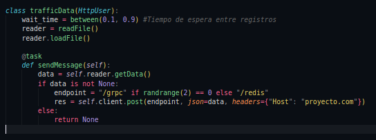
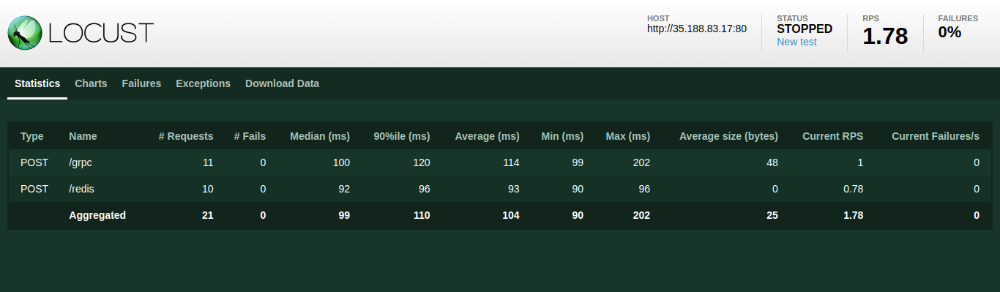
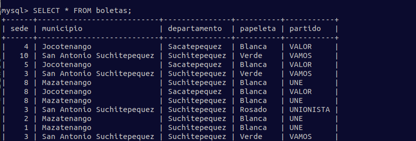
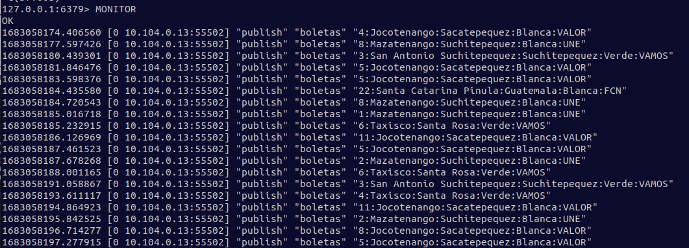
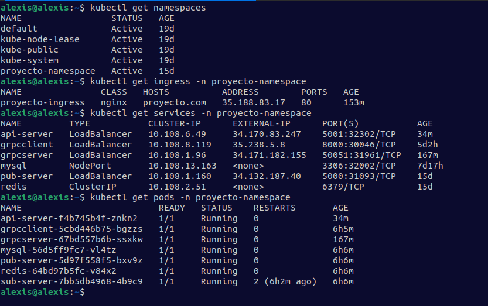
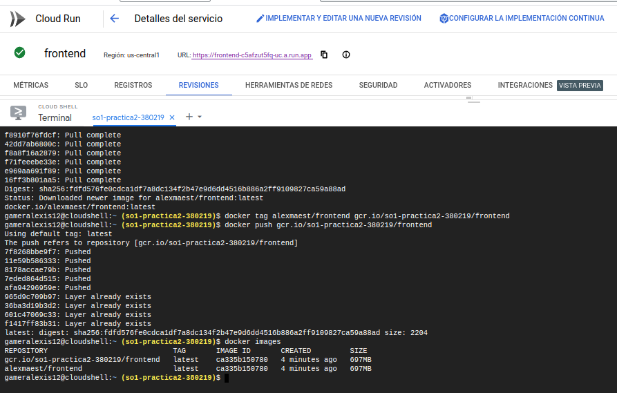

# Manual técnico | Proyecto

Universidad San Carlos de Guatemala  
Facultad de Ingeniería  
Escuela de Ciencias y Sistemas  
Sistemas Operativos 1 - Sección A  
Ing. Jesús Alberto Guzmán Polanco  
Aux. German Jose Paz Cordon  

| Nombre | Carnet |
|--|--|
| Henry Gabriel Peralta Martinez | 201712289  |
| Marvin Alexis Estrada Florian | 201800476 |

---
### Objetivos

 - Comprender la concurrencia y la teoría del paralelismo para desarrollar
sistemas distribuidos.
 - Experimentar y probar tecnologías de la nube que ayudan a desarrollar
sistemas distribuidos moderno.
 - Implementar contenedores y orquestadores en sistemas distribuidos.
 - Medir la fiabilidad y el rendimiento en sistemas de alta disponibilidad.

### Arquitectura

### Locust
Locust es una herramienta de prueba de rendimiento fácil de usar, programable y escalable. Se utilizo locust para mandar los votos por medio de un archivo json, se utilizo un archivo de python el cual se configuro para levantar locamente un puerto de locust. Y se utilizo el host de locust (http://localhost:8089) para mandar los datos, en esta se especifica la cantidad de usuarios, la cantidad de envios cada cierto tiempo y la dirección del servidor de grcp y el servidor de redis.

Como se muestró en la imagen anterior se tiene una distribución aleatoria de trafico entre 2 endopints configurados en el ingress del cluster sobre el cual será enviado el tráfico y este enrutado hacia sus respectivas áreas, en la siguiente imagen se muestra el servidor de Locust corriendo el cual sirve para activar el envío de datos, como también para monitoreo:

### Base de datos MySQL
En la base de datos se creo una tabla la cual tenia los siguientes campos: sede, municipio, departamento, papeleta y partido. Y esta base de datos se utilizo para guardar los datos provenientes de gRPC y Redis.

### Base de datos Redis
En la base de datos se creo una tabla la cual tenia los siguientes campos: sede, municipio, departamento, papeleta y partido. Y esta base de datos se utilizo para guardar los datos provenientes de Redis.

### API (Backend)
Se utilizo una api creada en node js, esta api sera el backend que obtiene los datos de la base de datos de Redis y MySQL. Se crearon endpoints los cuales obtendrán los datos de las bases y posteriormente el frontend consumirá esos datos. Para que esta funcione correctamente se descargaron las dependencias de express, ioredis, cors y mysql2.

### gRPC Client y gRPC Server
gRPC es un marco moderno de llamada a procedimiento remoto (RPC) de código abierto y alto rendimiento que puede ejecutarse en cualquier entorno. Puede conectar de manera eficiente los servicios dentro y entre los centros de datos con soporte conectable para balanceo de carga, rastreo, verificación de estado y autenticación. Se utilizo Node js para utilizar los servicios gRPC y por cada uno se tiene un archivo .proto el cual contiene la estructura de los datos que va a recibir. para guardar la información se utilizo una base de datos en MySQL. Para poder utilizarlo hay que descargar las dependencias de gRPC en el proyecto y estas deben estar en las carpetas del cliente y el servidor.

### Redis Pub y Redis Sub
Redis Pub/Sub es un protocolo de mensajería extremadamente ligero diseñado para transmitir notificaciones en vivo dentro de un sistema. Es ideal para propagar mensajes de corta duración cuando la baja latencia y el gran rendimiento son fundamentales. Para la utilización de redis se utilizo Go como lenguaje para el servidor. Los datos que van llegando se dirigen desde la configuración de redis pub y se mandan a una base de datos de redis y desde la configuracion de redis sub se obtienen los datos de la base de datos y esta los manda a la base de datos de MySQL. Para la utilización de redis pub y sub se descargaron los módulos de redis en Go.

### Docker y Docker hub
Docker es una plataforma de software que le permite crear, probar e implementar aplicaciones rápidamente. Se utilizo docker para volver cada parte del proyecto en imágenes funcionales y después se suben a un repositorio de docker hub. Docker hub es un repositorio público de imágenes de contenedores. También se utilizaron contenedores para las bases de datos.

### Cluster de Kubernetes
Un cluster de Kubernetes es un grupo de nodos (máquinas que ejecutan aplicaciones). Cada nodo puede ser una máquina física o una máquina virtual. La capacidad del nodo (su número de CPU y la cantidad de memoria) se define al crear el nodo.
Se creo un cluster de kubernetes para subir el proyecto a google cloud plataform, para este se separo cada sección del proyecto y se creo un deploy.yml, al hacer eso creamos varios pods que están creados de contenedores que ya teníamos en docker hub, también a cada uno se le da un servicio. Al finalizar de crear todos los pods del proyecto los juntamos todos en el cluster y este ya nos da una dirección ip para poder mostrar el proyecto fuera del servicio local.

Se muestra en la siguiente imagen todo lo que contiene el cluster, ya que principalmente se crea el namespace para contener todos nuestros recursos, posteriormente se tiene un ingress que nos ayuda a hacer el split del trafico entrante a los pods que reciben el mismo como lo son  el pub de redis y grpc client. A continuación de lo mencionado se muestran los servicios que permiten exponer los pods dentro y fuera del cluster según sea necesario y por último se muestran los pods que nos ayudan a mantener nuestra aplicación funcionando con la arquitectura solicitada: 

### Cloud Run
Cloud Run es una plataforma de procesamiento administrada que te permite ejecutar contenedores directamente sobre la infraestructura escalable de Google. Se utilizo cloud run para mostrar nuestra aplicación.

Por lo que se tiene a continuación su respectiva configuración descargando la imagen del frontend de Docker Hub para poder tenerla en el repositorio local de GCP y haciendole docker tag para que Cloud Run la reconozca como se muestra a continuación:

### Frontend
Para el frontend se utilizo react js, el cual mostrara la información consumida desde la api. En esta se mostraran tablas y gráficas, se mostrara una tabla la cual muestra todos los datos guardados en la base de datos, también una gráfica de barras que mostrara el top 3 de departamentos con mayores votos para presidente, también hay gráficas circulares que muestra el porcentaje de votos por partidos en cada departamento y municipio, también hay otra gráfica de barras que muestre las 5 sedes con mayores votos y por ultimo hay una tabla que muestra los últimos 5 votos almacenados en la base de Redis. Para este también se descargaron algunas dependencias para crear tablas y gráficas. 

###### _2023 - Laboratorio de Sistemas Operativos 1_
---
