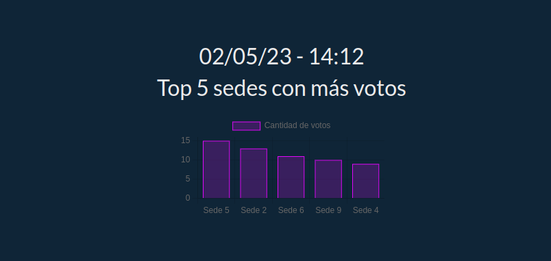
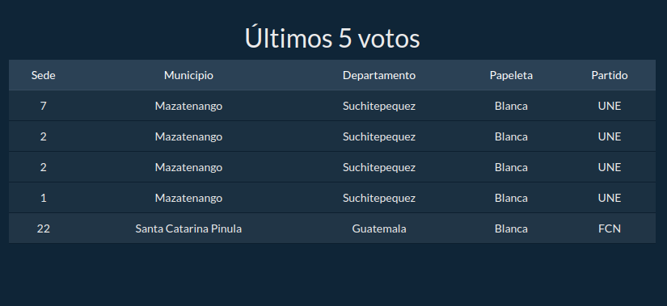
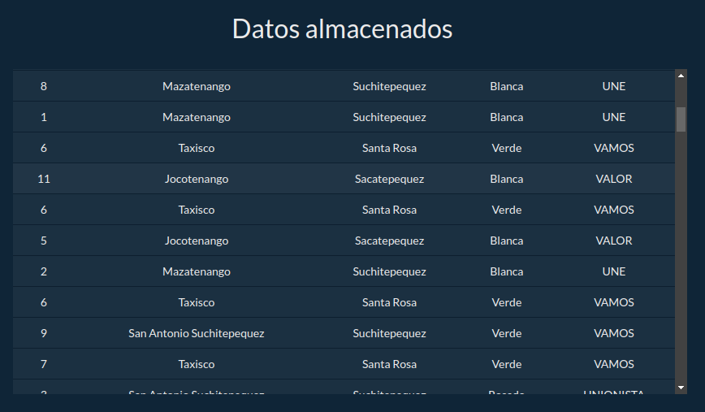
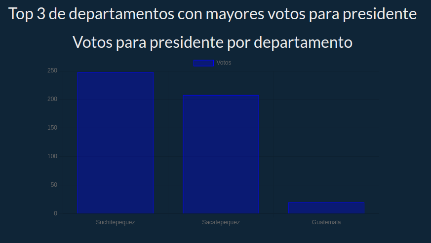
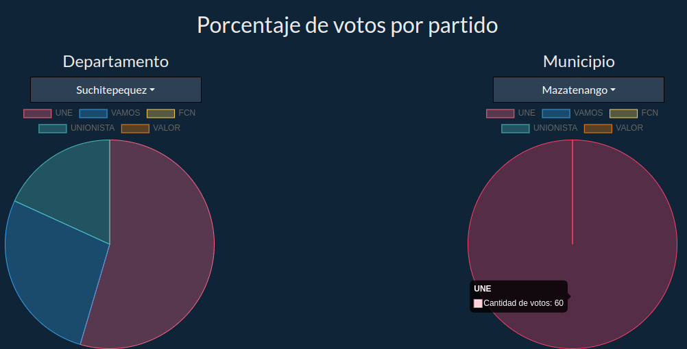

# Manual de usuario | Proyecto

Universidad San Carlos de Guatemala  
Facultad de Ingeniería  
Escuela de Ciencias y Sistemas  
Sistemas Operativos 1 - Sección A  
Ing. Jesús Alberto Guzmán Polanco  
Aux. German Jose Paz Cordon  

| Nombre | Carnet |
|--|--|
| Henry Gabriel Peralta Martinez | 201712289  |
| Marvin Alexis Estrada Florian | 201800476 |

---
### Levantar Locust para mandarle datos a la aplicación
Se utiliza locust para mandarle datos a la aplicación, primero tendríamos que crear un archivo json con los siguientes paramentos: sede, municipio, departamento, papeleta y partido. Una vez completado el json con toda la información procedemos a levantar locust en nuestro equipo y mandar la informacion a la aplicacion.

### Configuración Locust
 Una ves se levanto locust ingresamos a la dirección http://localhost:8089 y nos mostrara 3 opciones, la primera es para el numero de usuarios, con esta podemos elegir cuantos usuarios mandaran información a la aplicación, la segunda es para saber cada cuanto los usuarios mandan información y la ultima es para el host a donde deseemos mandar la información.

### Ingresar a la aplicación
Para poder utilizar la aplicación de votos en tiempo real debemos ingresar a la siguiente dirección https://frontend-c5afzut5fq-uc.a.run.app/ 

### Uso de la aplicación
Al ingresar a la aplicación puedes observar las distintas opciones que esta tiene, la primera opción hay una tabla que te muestra todos los votos que se han ingresado, en la segunda  se puede ver el top 3 de departamentos con mayores votos para presidente, en la tercera se muestran dos gráficas de pie una es de departamentos y la otra es de municipios y en ellas se muestra la cantidad de votos a los partidos por departamento o por municipio, en la cuarta se muestra el top 5 de sedes con mas votos y por ultimo se muestra una tabla con los últimos 5 votos que se han ingresado.

### Reportes

Se tiene un frontend donde se muestra únicamente el monitoreo de datos sobre votaciones a nivel nacional, por lo que se muestran a continuación las imágenes de lo mencionado con anterioridad:

###### _2023 - Laboratorio de Sistemas Operativos 1_
---